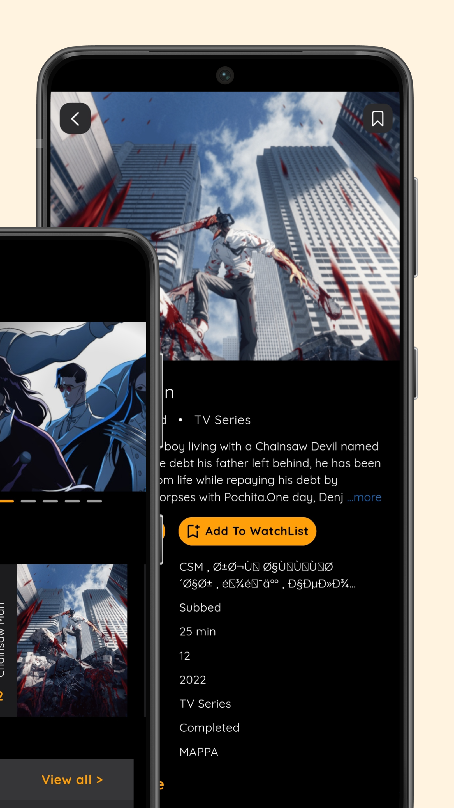

# animerush

Developed a cross-platform anime streaming app with advanced search and download functionality using Flutter. Utilized RESTful APIs to fetch and display content, and designed a visually appealing UI with modern material design principles.

---

## App Screenshots

<!-- You can use plain Markdown for images side by side, but for 6 images in a row, HTML is more reliable on GitHub. Reference the screenshots as: screenshots/1.png, screenshots/2.png, ..., screenshots/6.png --> <p align="center">       </p>

---

## Features

- Cross-platform mobile app for Android and iOS
- Advanced anime search and download
- RESTful API integration for dynamic content
- Secure modern UI with material design
- Optimized for performance and responsive layout

---

## Getting Started

### Prerequisites

- Flutter SDK installed (recommend latest stable version)  
  [Flutter installation guide](https://flutter.dev/docs/get-started/install)
- Android Studio or Visual Studio Code with Flutter plugin
- Xcode (for iOS development, on macOS)
- An emulator or physical device for testing

### Installation

1. Clone the repository:

```
git clone https://github.com/VaunshikaG/animerush.git
cd animerush
```

2. Install dependencies:

```
flutter pub get
```

3. Run the app:

- To run on Android emulator or device:

```
flutter run
```

- To run on iOS simulator or device (macOS only):

```
flutter run
```

---

## Folder Structure

```
lib/
  main.dart         # Entry point of the app
  ...               # Add your Dart files and folders here
android/            # Android platform files
ios/                # iOS platform files
```

---

## Development

- Use `flutter run` to launch the app on device or emulator.
- Use `flutter build` commands to generate release builds.
- Follow Flutter official docs for adding features and best practices:
  https://flutter.dev/docs

---

## Troubleshooting

- Make sure Flutter SDK is correctly installed and added to your PATH.
- Use `flutter doctor` to check your environment setup.
- If you encounter build or run issues, clean the build directory:

```
flutter clean
```

Then try rebuilding the app.

---

## Contributing

Feel free to fork and submit pull requests. For major changes, please open an issue first to discuss what you would like to change.

---

## License

Specify your license here, e.g., MIT License or others.

---

## Contact

For questions or support, please contact the maintainer.

```

If you want, I can also help add instructions for using specific packages or describe the app’s purpose in more detail once you provide that info! Let me know.

[1] https://github.com/VaunshikaG/animerush
